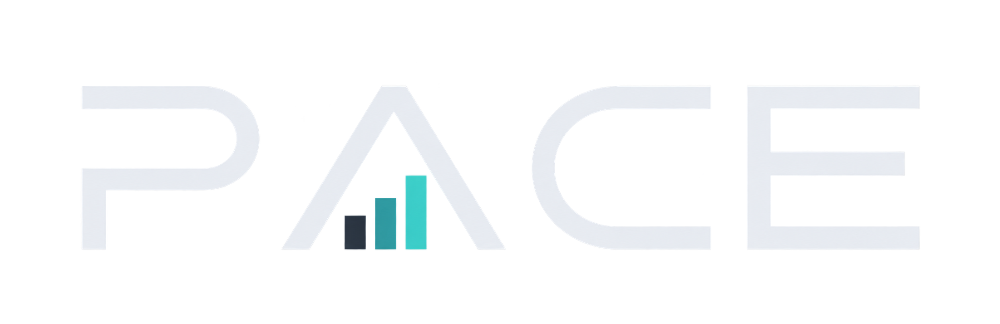
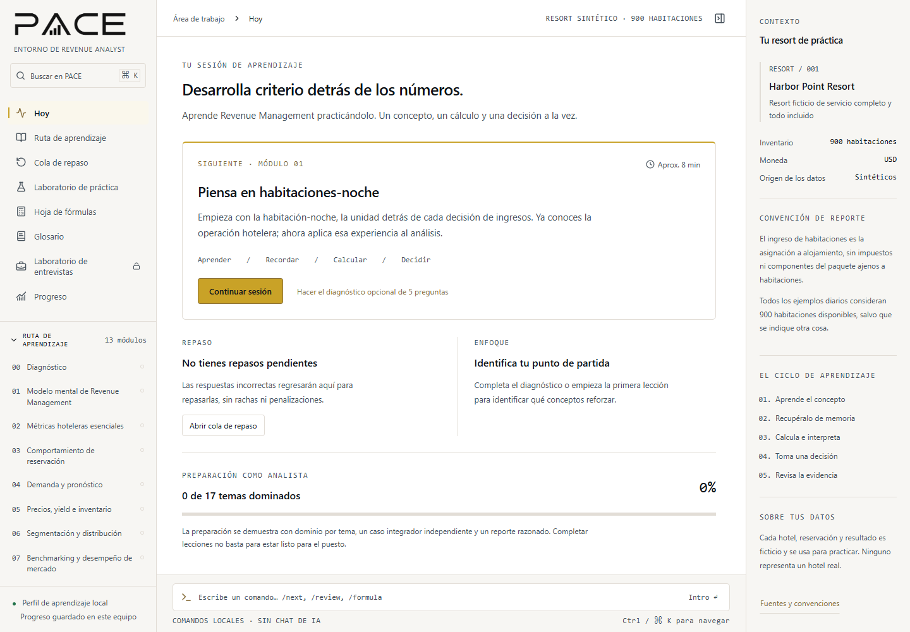

# PACE

A desktop learning workstation for Hotel Revenue Management, from hotel operations knowledge to junior Revenue Analyst practice.

PACE uses short lessons, retrieval questions, calculations, decisions and spaced review. Every hotel dataset is synthetic and models a roughly 900-room resort. It is a training tool, not a production revenue system or professional certification.

## What you can do

- Follow 17 lesson loops, with detailed foundations in mental models, metrics, booking behavior and forecasting.
- Calculate KPIs, compare booking snapshots and practice spreadsheet analysis.
- Work through a morning revenue workflow, meeting pack and independent capstone.
- Track completion separately from demonstrated mastery; revisit weak concepts.
- Export synthetic CSV datasets for practice in Excel.
- Use the command composer and Ctrl/Cmd + K to navigate.
- Unlock interview practice after completing lessons and submitting the capstone.

PACE is localized into neutral Latin American Spanish and optimized for desktop study. Progress stays on your computer. No account, backend or AI API is required.

## Download the Windows desktop beta

The current source includes an unreleased White Gold / Spanish update. The published **0.1.0-beta.1** download retains the original English Graphite / Teal interface. [Download PACE for Windows x64](https://github.com/dnmmraadev/pace/releases/download/v0.1.0-beta.1/PACE-0.1.0-beta.1-Windows.exe), then launch the portable executable. No development tools or server are required. The build is unsigned and stores progress locally.

See the [release notes and checksum](https://github.com/dnmmraadev/pace/releases/tag/v0.1.0-beta.1) and the [version policy](docs/versioning.md) for evaluation-stage limitations and future compatibility rules.

## Run from source

Use Node.js 22.12 or newer and npm. Node.js 22 is the documented development baseline.

    git clone https://github.com/dnmmraadev/pace.git
    cd pace
    npm ci
    npm run dev

Open the local address printed by Vite. To launch the Windows desktop application:

    npm run desktop

To build a portable Windows x64 executable:

    npm run desktop:package

The executable is written to ../pace-desktop/PACE-0.1.0-beta.1-Windows.exe. It runs without Node.js or a development server. Source builds require an Electron download during installation. See [desktop setup](docs/desktop.md) for packaging and storage details. Packaged macOS and Linux applications have not been verified.

## Check a change

    npm test
    npm run build
    npx playwright install chromium
    npm run test:browser

The browser check starts a local server when needed. See [development](docs/development.md) for test scope and an installed-Chrome alternative.

## Learning and data boundaries

Mastery normally requires at least five distinct answered questions and 80% accuracy, using the latest answer per question. Completion does not imply mastery. Incorrect answers enter a review queue; successful review uses a simple 1 / 3 / 7-day spacing heuristic.

Written reasoning is retained for comparison with model responses, but is not automatically assessed for commercial quality. Capstone objective scoring and written self-review serve different purposes. Local progress is not a cloud backup and browser progress does not automatically transfer into the desktop application.

## Local commands

| Command | Action |
| --- | --- |
| /next | Continue the learning session |
| /review | Open the review queue |
| /formula | Open the formula reference |
| /glossary | Open the glossary |
| /progress | View completion and mastery |
| /practice | Open the practice lab |
| /reset | Start the progress-reset flow |

## Documentation

| Guide | Purpose |
| --- | --- |
| [Architecture](docs/architecture.md) | Renderer, content, progress and desktop boundaries |
| [Development](docs/development.md) | Setup, checks and validation |
| [Desktop](docs/desktop.md) | Launching, packaging and troubleshooting |
| [Learning content](docs/learning-content.md) | Curriculum, synthetic-data rules and assessment model |
| [Design system](docs/design-system.md) | Canonical brand and Graphite / Teal tokens |
| [Documentation research](docs/documentation-research.md) | Sources reviewed and practices adopted |
| [Changelog](CHANGELOG.md) | Shipped behavior and limitations |
| [Localization](docs/localization.md) | Spanish terminology and persistence-safe display translation |
| [Versioning](docs/versioning.md) | Version research, compatibility contract and release procedure |

## Contributing, security and rights

Read [CONTRIBUTING](CONTRIBUTING.md) before proposing changes and [SECURITY](SECURITY.md) before reporting sensitive issues. Collaborators should follow the [code of conduct](CODE_OF_CONDUCT.md).

A distribution license has not been selected. The [rights notice](LICENSE) does not grant reuse rights. Third-party dependencies remain under their own licenses.

